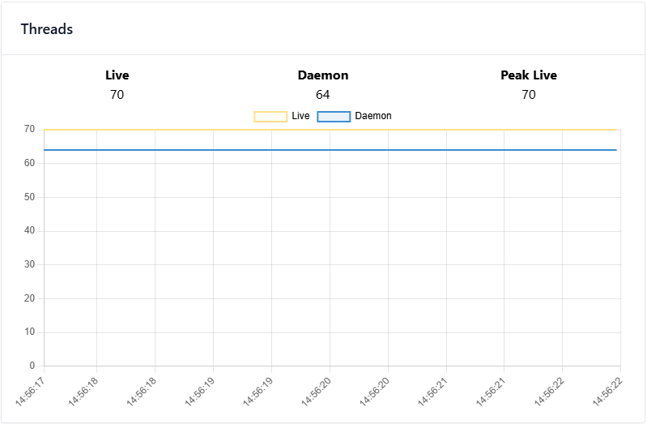
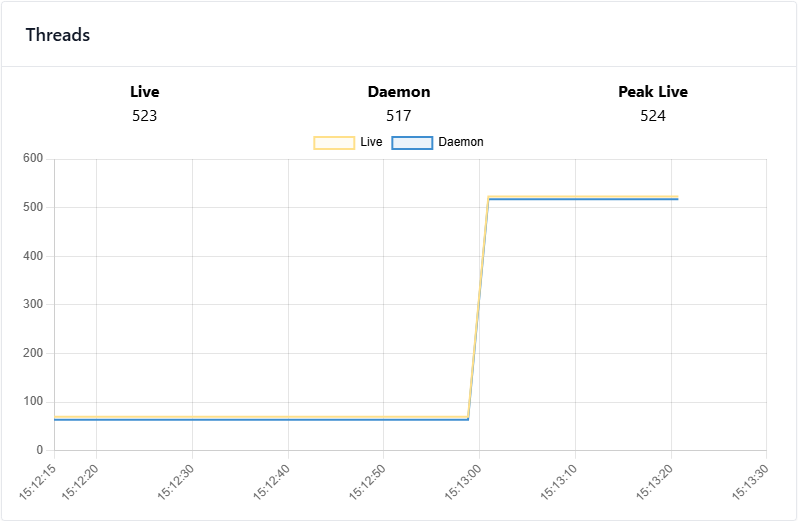
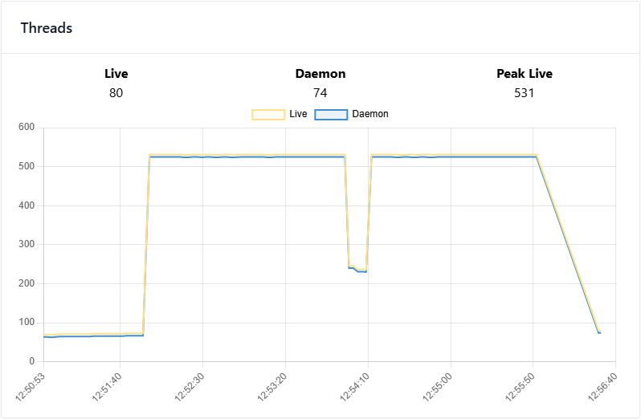

# Valkey Standalone Performance Test

## System Configuration

| Property           | Value                                               |
|--------------------|-----------------------------------------------------|
| Processor          | Intel(R) Core(TM) i7-9750H CPU @ 2.60GHz (2.59 GHz) |
| Core Count         | 6                                                   |
| Thread Count       | 12                                                  |
| Thread(s) per core | 2                                                   |
| RAM                | 24 GB (23.8 GB usable)                              |
| Architecture       | x64                                                 |
| Operating System   | Ubuntu 24.04.4 LTS                                  |

## Testing Tool
 is a tiny program that sends some load to a web application.
It is similar to ApacheBench (ab) but supports HTTP/2 and has more features.

## Valkey Configuration

| Property       | Value                    |
|----------------|--------------------------|
| ValKey Version | 8.1.6 64 Bit Open Source |
| ValKey Client  | valkey-glide [2.0.0,)    |

### Configuration File

```yaml
port 0
tls-port 6379

tls-cert-file /home/sabir/temp/valkey/valkey-local/tls/server.crt
tls-key-file /home/sabir/temp/valkey/valkey-local/tls/server.key
tls-ca-cert-file /home/sabir/temp/valkey/valkey-local/tls/ca.crt

tls-auth-clients no

########################
 # MULTI THREAD
 ########################

io-threads 4
io-threads-do-reads yes
# events-per-io-thread 0

########################

appendonly yes
dir /home/sabir/temp/valkey/valkey-local/data
bind 0.0.0.0
```

## Application Thread Configuration

```yaml
server:
  tomcat:
    threads:
      max: 500
      min-spare: 50
    accept-count: 200
```

## Performance Test Configuration

### Test Parameters

| Property          | Value                                                                                   |
|-------------------|-----------------------------------------------------------------------------------------|
| Duration of load  | 1 Minute                                                                                |
| Concurrency Level | 1000                                                                                    |
| HTTP Method       | PUT                                                                                     |
| Content-Type      | application/json                                                                        |
| Payload           | {"name":"Load Test","email":"load@email.com","city":"LoadLand","country":"LoadCountry"} |
| Target URL        | http://localhost:8080/users                                                             |

### CLI Command

```bash
hey -z 1m -c 1000 -m PUT -H "Content-Type: application/json" -d '{"name":"Load Test","email":"load@email.com","city":"LoadLand","country":"LoadCountry"}' http://localhost:8080/users
```

## Performance Test Results
**QPS Summary**

| Property           | Value     |
|--------------------|-----------|
| First Cycle QPS    | 5400.9991 |
| Second Cycle QPS   | 5990.8000 |

### First Cycle Results
```bash
Summary:
  Total:        60.2002 secs
  Slowest:      0.8849 secs
  Fastest:      0.0283 secs
  Average:      0.1847 secs
  Requests/sec: 5400.9991


Response time histogram:
  0.028 [1]     |
  0.114 [3559]  |■
  0.200 [234616]        |■■■■■■■■■■■■■■■■■■■■■■■■■■■■■■■■■■■■■■■■
  0.285 [66194] |■■■■■■■■■■■
  0.371 [17164] |■■■
  0.457 [2320]  |
  0.542 [378]   |
  0.628 [531]   |
  0.714 [221]   |
  0.799 [100]   |
  0.885 [57]    |


Latency distribution:
  10% in 0.1357 secs
  25% in 0.1475 secs
  50% in 0.1686 secs
  75% in 0.2032 secs
  90% in 0.2593 secs
  95% in 0.2981 secs
  99% in 0.3786 secs

Details (average, fastest, slowest):
  DNS+dialup:   0.0001 secs, 0.0283 secs, 0.8849 secs
  DNS-lookup:   0.0001 secs, 0.0000 secs, 0.0736 secs
  req write:    0.0001 secs, 0.0000 secs, 0.0431 secs
  resp wait:    0.1831 secs, 0.0279 secs, 0.5903 secs
  resp read:    0.0004 secs, 0.0000 secs, 0.0958 secs

Status code distribution:
  [200] 325141 responses
```
### Second Cycle Results (After 30 seconds of cooldown)
```bash
Summary:
  Total:        60.1252 secs
  Slowest:      0.3974 secs
  Fastest:      0.0278 secs
  Average:      0.1667 secs
  Requests/sec: 5990.8000


Response time histogram:
  0.028 [1]     |
  0.065 [89]    |
  0.102 [2192]  |
  0.139 [48919] |■■■■■■■■■■
  0.176 [198127]        |■■■■■■■■■■■■■■■■■■■■■■■■■■■■■■■■■■■■■■■■
  0.213 [85678] |■■■■■■■■■■■■■■■■■
  0.250 [17141] |■■■
  0.287 [5131]  |■
  0.323 [1917]  |
  0.360 [916]   |
  0.397 [87]    |


Latency distribution:
  10% in 0.1356 secs
  25% in 0.1452 secs
  50% in 0.1615 secs
  75% in 0.1806 secs
  90% in 0.2037 secs
  95% in 0.2229 secs
  99% in 0.2787 secs

Details (average, fastest, slowest):
  DNS+dialup:   0.0001 secs, 0.0278 secs, 0.3974 secs
  DNS-lookup:   0.0000 secs, 0.0000 secs, 0.0724 secs
  req write:    0.0001 secs, 0.0000 secs, 0.0500 secs
  resp wait:    0.1661 secs, 0.0136 secs, 0.3973 secs
  resp read:    0.0003 secs, 0.0000 secs, 0.0742 secs

Status code distribution:
  [200] 360198 responses
```
### Thread States

#### Initial Thread States



#### During Load Thread States



#### Cooldown Thread States

